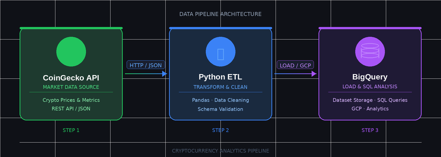

CRYPTO ETL PIPELINE (PYTHON + BIGQUERY ON GCP)

OVERVIEW
This project is an end-to-end ETL pipeline that extracts real-time cryptocurrency market data from a public API, transforms it, and loads it into a cloud data warehouse for analytics.

It demonstrates core Data Engineering skills, which include API usage, data transformation, and cloud based storage using modern tools.

TECH STACK
- Python 3.11
- Google BigQuery
- REST API (CoinGECKO)
- Pandas
- Google Cloud Authentication (Service Account)

ARCHITECTURE 

CoinGecko API -> Python ETL & Data Cleaning -> Big Query Dataset loading and SQL Analysis

FEATURES 
- Extracts live crypto market data (price, volume, market cap, etc)
- Cleans, Transforms timestamps into analytical features (date, hour)
- Loads structured data into BigQuery Table
- Fully automated pipeline (single script execution)

HOW TO RUN:
1. Clone project repository
git clone https://github.com/louisacheong/crypto-etl-pipeline.git
cd crypto-etl-pipeline

2. Create virtual environment
python -m venv venv
source venv/bin/activate

3. Install dependencies
pip install -r requirements.txt

4. Set authentication with generate json key from BigQuery
export GOOGLE_APPLICATION_CREDENTIALS="path/to/key.json"

5. Run pipeline
python pipeline.py

OUTPUT
- Data is loaded into BigQuery, ready for analysis
- crypto_dataset.crypto_data

EXAMPLE OF USE CASES
- Cryptocurrency Price Monitoring
- Market Trend Analysis
- Time-series Financial Analytics
- Cloud ETL Pipeline Demonstration

###This production-style ETL pipeline is made possible with AI tools and Google Cloud Platform###

